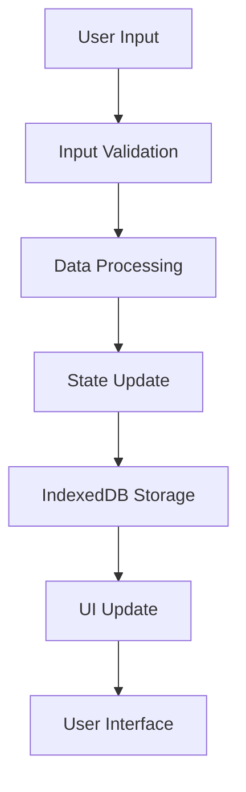

# Data Flow and Security Boundaries

## Overview

This document describes the data flow within Pe'n'ne and defines the security boundaries of the application. As a frontend-only application, all data processing and storage occurs within the user's browser.

## Data Flow Diagram

## Security Boundaries

### 1. User Input Boundary

- **Location**: Browser UI
- **Security Measures**:
  - Input validation
  - Type checking
  - Sanitization
- **Data Types**:
  - Report content
  - User preferences
  - Export settings

### 2. Processing Boundary

- **Location**: Application Memory
- **Security Measures**:
  - Memory isolation
  - Type safety
  - Error handling
- **Data Types**:
  - Report data
  - Application state
  - Temporary data

### 3. Storage Boundary

- **Location**: IndexedDB
- **Security Measures**:
  - Origin isolation
  - Access control
  - Data encryption
- **Data Types**:
  - Persistent data
  - User settings
  - Report history

## Data Flow Details

### 1. Input Processing

1. **User Input**
   - Form submissions
   - File uploads
   - Configuration changes

2. **Validation Layer**
   - Type checking
   - Format validation
   - Security checks

3. **Processing Layer**
   - Data transformation
   - State updates
   - Error handling

### 2. Storage Operations

1. **IndexedDB Operations**
   - Data persistence
   - Transaction management
   - Error recovery

2. **State Management**
   - React state updates
   - Context propagation
   - Component updates

3. **UI Updates**
   - Component rendering
   - Event handling
   - User feedback

## Security Considerations

### 1. Data Isolation

- **Browser Sandbox**
  - JavaScript execution context
  - DOM isolation
  - Network access

- **Storage Isolation**
  - IndexedDB namespace
  - Origin restrictions
  - Access controls

### 2. Data Protection

- **In-Memory Protection**
  - Variable scoping
  - Memory management
  - Garbage collection

- **Storage Protection**
  - Data encryption
  - Access controls
  - Backup mechanisms

### 3. Network Security

- **Content Security Policy**
  - Resource restrictions
  - Script execution
  - Data loading

- **Cross-Origin Protection**
  - Same-origin policy
  - CORS restrictions
  - Resource loading

## Error Handling

### 1. Input Errors

- Validation failures
- Type mismatches
- Format errors

### 2. Processing Errors

- State inconsistencies
- Memory issues
- Logic errors

### 3. Storage Errors

- Quota exceeded
- Transaction failures
- Data corruption

## Recovery Mechanisms

### 1. Data Recovery

- Automatic backups
- Error logging
- State restoration

### 2. Application Recovery

- Error boundaries
- Fallback UI
- State reset

### 3. User Recovery

- Error messages
- Recovery options
- Data export

## Monitoring and Logging

### 1. Error Tracking

- Error logging
- Performance monitoring
- Usage analytics

### 2. Security Monitoring

- Access attempts
- Data operations
- State changes

### 3. User Feedback

- Error messages
- Status updates
- Progress indicators 